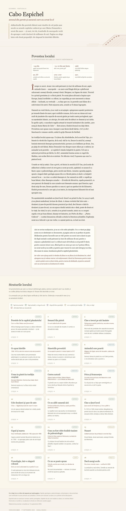
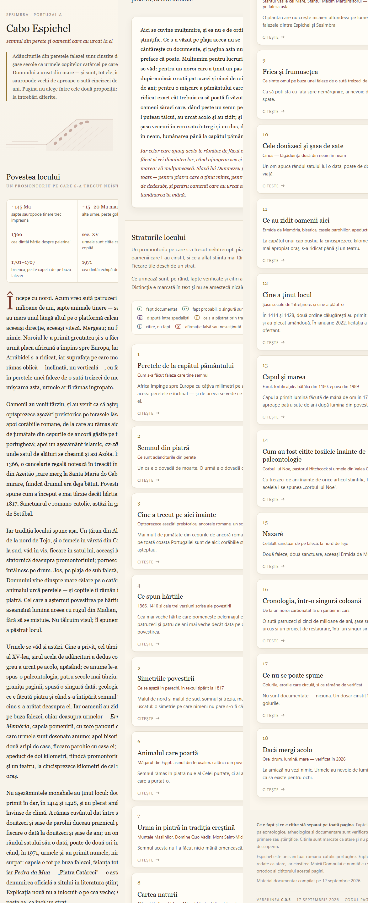
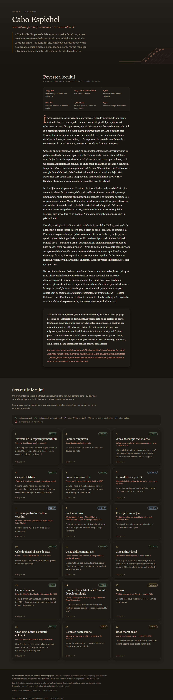
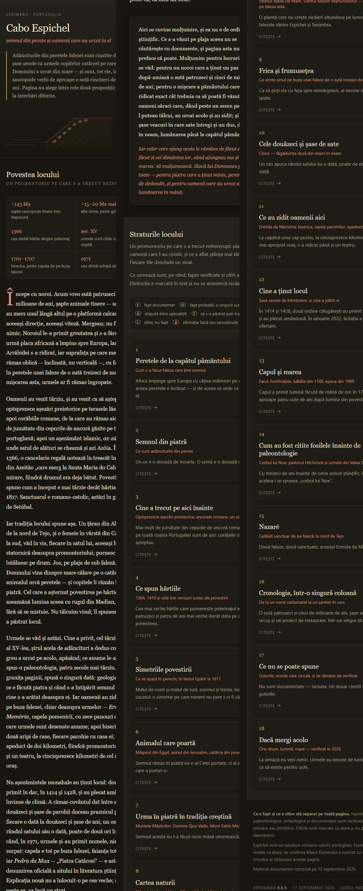

# Cabo Espichel — semnul din piatră

O pagină web autonomă despre promontoriul **Cabo Espichel** (Sesimbra, Portugalia), unde adânciturile din peretele falezei sunt cinstite de cel puțin șase secole ca urmele copitelor catârcei pe care Maica Domnului a urcat din mare — și sunt, tot ele, icnofosile de sauropode vechi de aproape o sută cincizeci de milioane de ani.

Pagina nu alege între cele două propoziții: ele răspund la întrebări diferite.

<table>
  <tr>
    <td width="50%" valign="top"></td>
    <td width="50%" valign="top"></td>
  </tr>
  <tr>
    <td align="center"><b>Desktop</b> — 1280px, pagina întreagă</td>
    <td align="center"><b>Telefon</b> — 375px, pagina întreagă, așezată în trei coloane</td>
  </tr>
</table>

  
Aceleași două, în tema întunecată

  <table>
    <tr>
      <td width="50%" valign="top"></td>
      <td width="50%" valign="top"></td>
    </tr>
  </table>
  
Pagina urmează tema sistemului: nu are comutator, se schimbă singură după <code>prefers-color-scheme</code>.

## Cum se deschide

Un singur fișier, `index.html`, fără nicio dependență externă — nici bibliotecă, nici font, nici imagine de pe alt server. Se deschide offline, dintr-un dublu-click.

## Ce conține

O **poveste centrală** scurtă, precedată de o bandă cu reperele locului — de la urmele lăsate acum vreo sută patruzeci și cinci de milioane de ani până la prima echipă de cercetare, în 1971.

Sub ea, **optsprezece secțiuni** care se deschid în ferestre modale: geologia falezei și cum a ajuns înclinată, urmele de dinozauri și cercetarea lor de până în 2025, trecerile preistorice, romane și islamice, documentele medievale, tradiția locului, animalul care poartă, urma în piatră în tradiția creștină, cartea naturii, frica și frumusețea, rânduiala celor douăzeci și șase de sate, ce s-a zidit acolo, cine a ținut locul, marea și farul, citirea fosilelor înainte de paleontologie, Nazaré, cronologia și limitele dosarului — plus informația practică de teren.

Fereastra deschisă își ține minte unde ai rămas: un cartonaș citit pe jumătate se redeschide de acolo, cât ține vizita.

## Cum se citește

Fiecare afirmație e marcată, iar distincția e ținută peste tot:

| Marcaj | Înseamnă |
|---|---|
| **F** | fapt documentat, verificat în cel puțin o sursă primară sau științifică |
| **F?** | fapt probabil, dintr-o singură sursă, neverificat independent |
| **D** | dispută reală între specialiști |
| **T** | ce s-a păstrat prin tradiție — povestire, nu document |
| **I** | citire, nu fapt |
| **✗** | afirmație care circulă și care este falsă sau nesusținută |

## Versiuni

O versiune pentru fiecare push, nu pentru fiecare commit. Intrarea unei versiuni explică toate commit-urile cuprinse în acel push.

Aici stau numai versiunile care există deja în depozit: lista nu anunță niciodată o versiune neîmpinsă. Intrarea unei versiuni noi intră chiar în commit-ul cu care e împinsă.

Fiecare commit are și el un număr, de forma **`0.0.N.xx`**: versiunea push-ului, plus poziția commit-ului în interiorul ei, începând de la `01`. Contorul repornește la fiecare versiune. Numărul stă în subiectul commit-ului și în lista de mai jos; nu se pun etichete git pe commit-uri, ca lista de etichete să rămână a versiunilor.

Commit-urile de până la 0.0.5 au fost împinse înainte ca schema să existe, așa că numerele lor sunt consemnate numai aici. Subiectele lor nu se rescriu: asta ar schimba toate hash-urile și ar rupe etichetele deja publicate. Prefixul în subiect începe de la commit-urile de după.

Intrarea celei mai noi versiuni poartă doar numerele: hash-urile i se adaugă la versiunea următoare, fiindcă un commit nu-și poate cunoaște dinainte propriul hash. Numărul, în schimb, se atribuie dinainte — de asta există.

Capturile stau în `docs/<versiune>/`. Un set nou se face doar când pagina chiar arată altfel — o versiune care schimbă numai comportamentul sau documentația trimite la setul versiunii dinainte și spune asta. Se generează cu `tools/capturi.ps1`.

### 0.0.6

`0.0.6.01`

Commit-urile capătă numere. Fiecare primește un `0.0.N.xx` — versiunea push-ului, plus poziția în interiorul ei — scris ca prefix în subiect și listat aici, lângă hash. Etichetele git rămân doar ale versiunilor.

Istoricul de până acum s-a numerotat fără nicio rescriere: cele șase commit-uri și cele cinci etichete sunt neatinse, iar numerele lor sunt consemnate în intrările de mai jos. Subiectele vechi rămân cum au fost — rescrierea lor ar fi schimbat toate hash-urile și ar fi rupt etichetele deja publicate.

Așa capătă identificare și versiunea 0.0.5, care rămăsese fără: hash-ul nu i se putuse scrie, fiindcă un commit nu-și poate conține propriul identificator, dar un număr atribuit dinainte nu are problema asta.

### 0.0.5

`0.0.5.01` `60b9eb7`

Pagina își spune versiunea. În subsol, ultimul rând, un colofon despărțit printr-o linie subțire: versiunea, data ei și o legătură către depozit. Cine are o copie a fișierului știe acum ce ține în mână. Legătura nu încarcă nimic de pe alt server, deci pagina rămâne autonomă.

`tools/capturi.ps1` face cele patru capturi pentru orice versiune. Nu i se dă înălțimea paginii: capturează pe o fereastră mai înaltă decât pagina și taie de la bază rândurile care sunt integral fundal. Tema se forțează, altfel Chromium preia tema sistemului și toate capturile ies la fel.

Capturile s-au mutat în foldere pe versiuni, `docs/<versiune>/`. Refăcute cu instrumentul, cele de la 0.0.4 au ieșit mai scurte decât cele dinainte: vechea captură de telefon fusese făcută pe o înălțime măsurată cu bara de derulare vizibilă și avea la coadă vreo o mie șase sute de pixeli goi.

Tot aici s-au scris în README regulile de versionare de mai sus, iar intrarea 0.0.4 a fost completată cu al doilea hash, care lipsea.

### 0.0.4

`0.0.4.01` `11a7043` · `0.0.4.02` `f24a954`

`0.0.4.01` aduce README-ul rescris pe versiuni și primele capturi ale întregii pagini — desktop și telefon, în temă luminoasă și întunecată.

`0.0.4.02` scoate din secțiunea „Ce nu se poate spune" mențiunea despre sebastianism. Rămân neatinse corectura despre Camões, Pessoa și Almada Negreiros, cea despre versul gravat la Cabo da Roca, și poetul Sebastião da Gama — care e altceva decât mitul, chiar dacă poartă același nume.

### 0.0.3

`0.0.3.01` `126612a`

Fereastra modală ține minte poziția de citire. Un cartonaș deschis prima oară pornește de sus; unul deschis a doua oară se redeschide exact unde a rămas cititorul, cât ține vizita.

Poziția se reține pe măsură ce se derulează, nu la închidere — la închidere `<dialog>` e deja ascuns, iar `scrollTop` al unui element ascuns se citește 0. Așa sunt acoperite toate căile de închidere: butonul, Esc și clicul pe fundal.

### 0.0.2

`0.0.2.01` `40e4eea`

Scoasă secțiunea „Capete de lume", tabelul care compara promontoriul cu alte capete de lume. Cartonașele s-au renumerotat singure, de la 19 la 18, fiindcă numărul e calculat din poziție.

Corectura despre versul *„onde a terra se acaba e o mar começa"* — gravat la Cabo da Roca, fără legătură cu Espichel — trăia numai în tabelul scos, așa că a fost mutată în secțiunea „Ce nu se poate spune".

### 0.0.1

`0.0.1.01` `7297996`

Prima publicare: pagina autonomă, cu povestea centrală, nouăsprezece secțiuni în ferestre modale și marcajele de fiabilitate pe fiecare afirmație.

Fiecare versiune are eticheta ei în depozit: `v0.0.1`, `v0.0.2`, `v0.0.3`, `v0.0.4`, `v0.0.5`, `v0.0.6`.

## Despre sanctuar

Espichel este un sanctuar marian romano-catolic portughez, aflat astăzi în grija Diecezei de Setúbal. Faptele sunt redate ca atare; cinstirea Maicii Domnului e numită însă cu vocabularul ortodox al cititorului căruia îi e scrisă pagina.

## Surse

Pagina e construită dintr-un dosar documentar propriu, cu bibliografie primară și științifică: cartografia geologică 1:50.000 (foaia 38-B Setúbal) și Kullberg et al. (2013) pentru tectonică; Lockley, Meyer & dos Santos (*Gaia* 10, 1994) pentru turma de sauropode juvenile; Antunes & Mateus (*C. R. Palevol* 2, 2003); Figueiredo et al. (2021–2025) pentru cercetarea recentă; Figueiredo & Carvalho (2014) pentru preistorie; Strabon III.1.4 și III.3.1 pentru sursele antice; plus documentele și sursele de epocă ale sanctuarului — atestarea din 1366, *Santuário Mariano* (1707) și Frei Cláudio da Conceição (1817).
